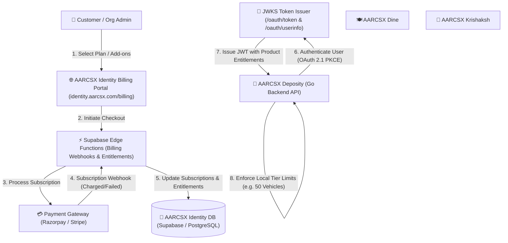

# AARCSX Identity — Unified Subscription Management Architecture ("Google One for AARCSX")

> **Vision**: Transform **AARCSX Identity (`identity.aarcsx.com`)** into the centralized subscription, entitlement, and billing hub for the entire AARCSX ecosystem (Deposity, Dine, Krishaksh, Forge, Docs). Just as **Google One** manages storage, Workspace, and premium subscriptions across Google products in one place, AARCSX Identity will serve as the single source of truth for organization subscriptions, billing gateways, multi-product entitlement tokens, and unified invoice management.

---

## 🏛️ 1. Conceptual Architecture & Paradigm



### Key Principles:
1. **Single Billing Account**: One payment method and one monthly/annual invoice for an organization using multiple AARCSX products.
2. **Decoupled Entitlements**: Individual products (like Deposity) contain zero billing logic—they simply read signed entitlement claims from JWT tokens issued by Identity.
3. **Centralized Customer Portal**: Upgrades, downgrades, add-ons, GST billing details, and payment receipts are managed exclusively at `identity.aarcsx.com/billing`.

---

## 💾 2. Enhanced Database Schema Design (`server/migrations/0014_unified_subscription_engine.sql`)

Expand the current lightweight `subscriptions` and `product_access` tables into a production-grade multi-product subscription architecture.

```sql
-- 1. Master Plans Table (Defines global tiers across products)
CREATE TABLE IF NOT EXISTS public.plans (
  id UUID PRIMARY KEY DEFAULT gen_random_uuid(),
  code TEXT UNIQUE NOT NULL, -- e.g. 'deposity_starter', 'deposity_business', 'ecosystem_enterprise_pass'
  product_code TEXT NOT NULL, -- 'deposity', 'dine', 'krishaksh', 'all'
  name TEXT NOT NULL, -- 'Business Plan'
  description TEXT,
  billing_cycle TEXT NOT NULL CHECK (billing_cycle IN ('monthly', 'quarterly', 'half-yearly', 'yearly')),
  price_inr NUMERIC(10, 2) NOT NULL,
  discount_percentage NUMERIC(5, 2) DEFAULT 0,
  is_active BOOLEAN DEFAULT true,
  created_at TIMESTAMP WITH TIME ZONE DEFAULT NOW()
);

-- 2. Product Entitlements (Specific feature limits per plan)
CREATE TABLE IF NOT EXISTS public.plan_entitlements (
  id UUID PRIMARY KEY DEFAULT gen_random_uuid(),
  plan_id UUID NOT NULL REFERENCES public.plans(id) ON DELETE CASCADE,
  feature_key TEXT NOT NULL, -- e.g. 'max_vehicles', 'max_branches', 'ai_insights_enabled', 'gps_tracking'
  feature_value JSONB NOT NULL, -- e.g. 50, 5, true, false
  created_at TIMESTAMP WITH TIME ZONE DEFAULT NOW(),
  UNIQUE (plan_id, feature_key)
);

-- 3. Organization Master Subscription (Unified billing subscription)
CREATE TABLE IF NOT EXISTS public.organization_subscriptions (
  id UUID PRIMARY KEY DEFAULT gen_random_uuid(),
  organization_id UUID NOT NULL UNIQUE REFERENCES public.organizations(id) ON DELETE CASCADE,
  gateway_customer_id TEXT, -- Razorpay cust_xxxx / Stripe cus_xxxx
  gateway_subscription_id TEXT, -- Razorpay sub_xxxx / Stripe sub_xxxx
  status TEXT NOT NULL DEFAULT 'active' CHECK (status IN ('trialing', 'active', 'past_due', 'canceled', 'paused')),
  current_period_start TIMESTAMP WITH TIME ZONE NOT NULL,
  current_period_end TIMESTAMP WITH TIME ZONE NOT NULL,
  cancel_at_period_end BOOLEAN DEFAULT false,
  metadata JSONB NOT NULL DEFAULT '{}'::jsonb,
  created_at TIMESTAMP WITH TIME ZONE DEFAULT NOW(),
  updated_at TIMESTAMP WITH TIME ZONE DEFAULT NOW()
);

-- 4. Organization Product Items (Active products & add-ons attached to org subscription)
CREATE TABLE IF NOT EXISTS public.organization_product_subscriptions (
  id UUID PRIMARY KEY DEFAULT gen_random_uuid(),
  organization_id UUID NOT NULL REFERENCES public.organizations(id) ON DELETE CASCADE,
  plan_id UUID NOT NULL REFERENCES public.plans(id) ON DELETE RESTRICT,
  product_code TEXT NOT NULL, -- 'deposity'
  status TEXT NOT NULL DEFAULT 'active',
  addon_features JSONB NOT NULL DEFAULT '{}'::jsonb, -- e.g. {"whatsapp_notifications": true, "extra_users": 20}
  created_at TIMESTAMP WITH TIME ZONE DEFAULT NOW(),
  updated_at TIMESTAMP WITH TIME ZONE DEFAULT NOW(),
  UNIQUE (organization_id, product_code)
);

-- 5. Real-Time Usage Meters (Tracks active usage against limits)
CREATE TABLE IF NOT EXISTS public.organization_usage_meters (
  id UUID PRIMARY KEY DEFAULT gen_random_uuid(),
  organization_id UUID NOT NULL REFERENCES public.organizations(id) ON DELETE CASCADE,
  product_code TEXT NOT NULL,
  metric_key TEXT NOT NULL, -- e.g. 'active_vehicles', 'active_users', 'monthly_ai_scans'
  current_value INTEGER NOT NULL DEFAULT 0,
  updated_at TIMESTAMP WITH TIME ZONE DEFAULT NOW(),
  UNIQUE (organization_id, product_code, metric_key)
);

-- 6. Unified Invoices Table
CREATE TABLE IF NOT EXISTS public.invoices (
  id UUID PRIMARY KEY DEFAULT gen_random_uuid(),
  organization_id UUID NOT NULL REFERENCES public.organizations(id) ON DELETE CASCADE,
  invoice_number TEXT UNIQUE NOT NULL, -- e.g. 'INV-AARCSX-2026-00482'
  amount_paid NUMERIC(10, 2) NOT NULL,
  tax_amount NUMERIC(10, 2) NOT NULL DEFAULT 0, -- GST calculation
  currency TEXT DEFAULT 'INR',
  status TEXT NOT NULL CHECK (status IN ('paid', 'open', 'void', 'uncollectible')),
  pdf_url TEXT,
  created_at TIMESTAMP WITH TIME ZONE DEFAULT NOW()
);
```

---

## 🔐 3. Token-Based Entitlement Propagation (OIDC Claims)

When a user logs into any product (e.g. **Deposity**) via `identity.aarcsx.com/oauth/authorize`, Identity generates a JWT access token containing the organization's active **product entitlements**.

### Example JWT Token Payload:
```json
{
  "iss": "https://identity.aarcsx.com",
  "sub": "user_9f823a-48b1",
  "aud": "deposity_client",
  "exp": 1784738400,
  "tenant_id": "tenant_jumbo_road_9281",
  "org_id": "org_4812",
  "user_role": "Owner",
  "entitlements": {
    "deposity": {
      "plan": "Business",
      "status": "active",
      "limits": {
        "max_vehicles": 50,
        "max_users": 35,
        "max_branches": 5,
        "ai_insights": true,
        "predictive_maintenance": true,
        "fastag_management": true,
        "fuel_logs": true
      }
    },
    "dine": {
      "plan": "Starter",
      "status": "active",
      "limits": {
        "max_tables": 15
      }
    }
  }
}
```

### Benefit for Ecosystem Applications:
* **Deposity Go Backend** reads `claims["entitlements"]["deposity"]`.
* When a user clicks `+ Add Vehicle`, Deposity compares `current_vehicle_count` against `max_vehicles` locally.
* **Zero DB latency**: No network calls back to Identity DB during routine API operations.

---

## ⚡ 4. Centralized Billing Edge Functions (`supabase/functions/`)

Implement 3 new serverless Edge Functions in `AARCSX_Identity`:

1. **`create-checkout-session`**:
   * Accepts `organization_id`, `plan_code`, `billing_cycle`, and `addons`.
   * Interacts with Razorpay / Stripe API to create a subscription order.
   * Returns checkout session credentials to the frontend UI.

2. **`billing-webhook`** (`/functions/v1/billing-webhook`):
   * Authenticates Razorpay webhook signature (`X-Razorpay-Signature`).
   * Handles events:
     * `subscription.charged`: Extends `current_period_end`, generates invoice record in `invoices` table, and sends branded receipt email via Brevo.
     * `payment.failed`: Updates subscription status to `past_due`, alerts organization owner via email, and triggers a 7-day grace period.
     * `subscription.halted` / `cancelled`: Updates status to `canceled` and revokes premium entitlements.

3. **`manage-subscription`**:
   * Enables upgrading/downgrading plans, changing billing cycles (Monthly to Yearly), and toggling modular add-ons (e.g. AI Intelligence Pack, WhatsApp Notifications).

---

## 🖥️ 5. Centralized Billing Portal UI (`identity.aarcsx.com/billing`)

Create a unified billing dashboard in the React/Vite frontend of `AARCSX_Identity` under `src/pages/billing/`:

```
┌────────────────────────────────────────────────────────────────────────┐
│  AARCSX Identity — Organization Billing & Subscriptions                │
├────────────────────────────────────────────────────────────────────────┤
│  Organization: Jumbo Road Carrier (tenant_jumbo_road)                  │
├────────────────────────────────────────────────────────────────────────┤
│                                                                        │
│  📦 ACTIVE PRODUCT SUBSCRIPTIONS                                       │
│  ┌──────────────────────────────────┐ ┌─────────────────────────────┐ │
│  │ 🚚 AARCSX Deposity               │ │ 🍽️ AARCSX Dine              │ │
│  │ Plan: Business Plan (Yearly)     │ │ Plan: Starter Plan          │ │
│  │ Status: Active (Renews 2027)     │ │ Status: Active              │ │
│  │ Usage: 28 / 50 Vehicles          │ │ Usage: 8 / 15 Tables        │ │
│  │ [Manage Plan] [Add Vehicles]     │ │ [Manage Plan]               │ │
│  └──────────────────────────────────┘ └─────────────────────────────┘ │
│                                                                        │
│  💳 PAYMENT METHOD & GSTIN DETAILS                                     │
│  • Default Card: Visa ending in 4242                                   │
│  • GSTIN: 27AAAAA0000A1Z5                                              │
│  • Billing Email: billing@jumboroad.com                                │
│                                                                        │
│  📄 INVOICE HISTORY                                                    │
│  • INV-2026-001 | 15 Jan 2026 | ₹1,43,988 | Paid [Download PDF]        │
│  • INV-2025-084 | 15 Jan 2025 | ₹1,43,988 | Paid [Download PDF]        │
└────────────────────────────────────────────────────────────────────────┘
```

---

## 🚀 6. Step-by-Step Execution Roadmap

### Phase 1: Database Foundation
* [ ] Create `server/migrations/0014_unified_subscription_engine.sql` in `AARCSX_Identity`.
* [ ] Seed master plan data for Deposity (`deposity_starter`, `deposity_growth`, `deposity_business`, `deposity_enterprise`) and ecosystem bundles.

### Phase 2: Edge Functions & Webhooks
* [ ] Deploy `supabase/functions/create-checkout-session`.
* [ ] Deploy `supabase/functions/billing-webhook` with Razorpay/Stripe webhook verification.
* [ ] Configure Brevo email template for subscription receipts (`EMAIL_BILLING_FROM`).

### Phase 3: JWT Entitlements Injection
* [ ] Update `oauth-token` and `oauth-userinfo` Edge Functions in `AARCSX_Identity` to query active entitlements and include them in token claims.

### Phase 4: Billing Portal UI
* [ ] Build `src/pages/billing/BillingDashboard.tsx` in `AARCSX_Identity`.
* [ ] Add plan upgrade/downgrade selector, billing cycle toggle, and invoice PDF viewer.

### Phase 5: Ecosystem Product Enforcement
* [ ] Update product backends (e.g., Deposity Go REST API) to validate `entitlements` from incoming JWTs and enforce limits seamlessly.
