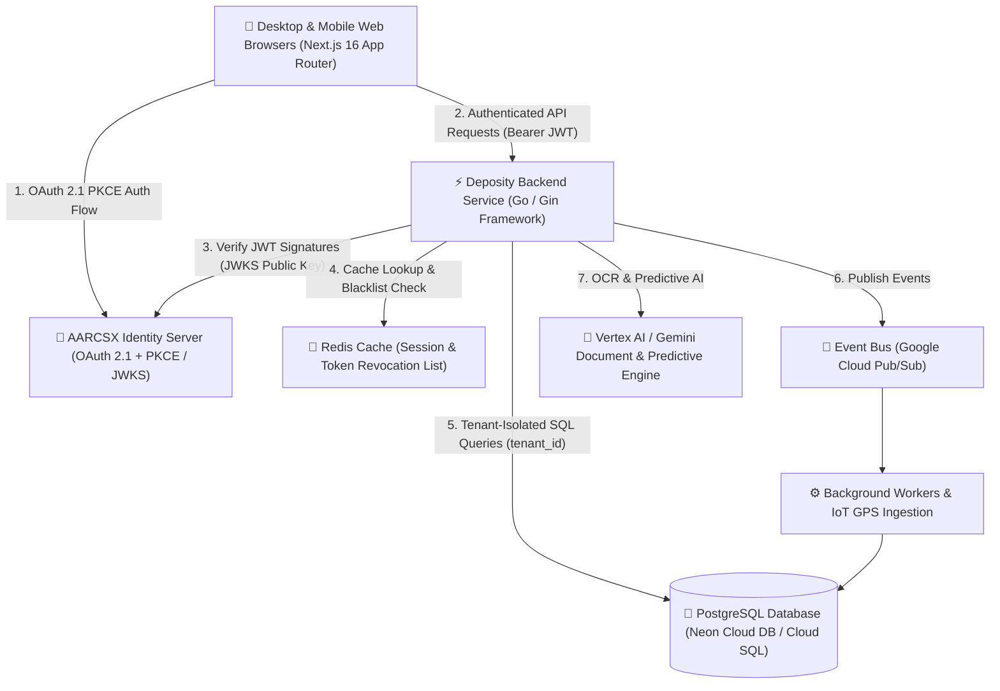

# AARCSX Deposity — System Architecture & Feature Specification

> **Product Vision**: AARCSX Deposity is a next-generation multi-tenant SaaS platform built for logistics enterprises, fleet owners, and transport depot managers to streamline vehicle compliance monitoring, FASTag financial audits, fuel telemetry tracking, trip dispatching, driver rosters, and asset maintenance.

---

## 🏛️ System Architecture Overview

AARCSX Deposity is designed using a modern, decoupled microservices-ready modular monolith architecture. It separates the high-performance Go backend REST API from the dynamic Next.js 16 frontend interface, with delegated authentication managed by the centralized **AARCSX Identity** platform.



---

## 🛠️ Technology Stack

| Layer | Technology / Framework | Description |
| :--- | :--- | :--- |
| **Frontend UI** | **Next.js 16 (App Router)** | Server & Client components, Turbopack, React 19 |
| **Styling & Design** | **Tailwind CSS + Material Design 3** | Curated dark/light theme tokens, Material Symbols, glassmorphic UI |
| **Backend API** | **Go (Golang 1.22+) & Gin** | High-throughput compiled RESTful microservice framework |
| **Database** | **PostgreSQL (Neon / GCP Cloud SQL)** | Serverless/Managed PostgreSQL with TLS encryption & connection pooling |
| **Migrations** | **Golang Migrate** | 14 automated schema migration scripts tracking system evolution |
| **Caching & State** | **Redis 7 (GCP Memorystore)** | Distributed key-value cache for session validation & JWT revocation |
| **Event System** | **GCP Cloud Pub/Sub** | Asynchronous message broker for telemetry, alerts & audit events |
| **Cloud Hosting** | **Google Cloud Run** | Fully managed serverless container runtime auto-scaling 0 to N |
| **Authentication** | **AARCSX Identity (PKCE OAuth 2.1)** | Enterprise Single Sign-On (SSO) with JWKS public key verification |

---

## 🚀 Key Architectural Features & Modules

### 1. 🚚 Vehicle Fleet & Regulatory Compliance Engine
* **Full Asset Profile**: Track vehicle registration numbers, make/model, manufactured year, chassis number, engine number, and axle counts.
* **Dynamic Compliance Status**: Real-time visual indicator dots for critical regulatory documents:
  * 📜 **National Permit** (Issuance & Expiry)
  * 📜 **State Permit** (Issuance & Expiry)
  * 🛡️ **Insurance Policy**
  * 🏋️ **Fitness Certificate**
  * 💨 **Pollution Under Control (PUC)**
  * 💳 **FASTag Issued Status**
* **Automated Expiry Timeline**: Status dots dynamically transition between:
  * 🟢 **Valid / Green** (`> 30 days remaining`)
  * 🟡 **Expiring Soon / Yellow** (`<= 30 days remaining`)
  * 🔴 **Expired / Red** (`Overdue / Action required`)

### 2. 💳 FASTag Balance Audit & Financial History
* **Recharge Ledger**: Log amount added, date-time timestamp, remaining wallet balance, and bank transaction/reference numbers.
* **Audit Trail**: Replaced redundant transaction lists with a streamlined audit history of money put into each vehicle's FASTag wallet.
* **Inline Actions**: Delete and audit entries with instant optimistic UI updates and backend cache invalidation.

### 3. ⛽ Fuel & Urea (DEF) Refilling Telemetry
* **Dual Refuel Logging**: Track **Diesel** and **Urea (AdBlue)** consumption separately with badge categorization.
* **Automated Rate Calculation**: Input volume in litres and total bill amount (₹); the system auto-calculates per-litre rates (`₹/L`).
* **Pump / Location Logging**: Store fuel station vendor names (e.g. *Indian Oil NH-44 Toll Pump*).
* **Summary Analytics**: Real-time aggregation of Total Diesel Volume, Total Urea Volume, Total Spent, and Average Diesel Price per Litre.

### 4. 🏦 EMI Installment & Loan Schedule Tracker
* **Financed Asset Management**: Record vehicle loan details, financing bank name, monthly EMI installment amount, and payment due date.
* **Installment Ledger**: Track payment statuses (`Paid` vs. `Pending`) with action controls to record bank payments.

### 5. 🛣️ Trip Dispatching & Freight Billing
* **Logistics Dispatch**: Create and monitor trips linking Vehicles, Drivers, Origin, Destination, Cargo Type, and Weight (in Tons).
* **Financial Calculations**: Calculate freight income using `rate_per_ton`, advance payments received, and balance due from client companies.
* **Trip Lifecycle**: Monitor real-time status transitions: `Scheduled` ➔ `In-Transit` ➔ `Completed` ➔ `Cancelled`.

### 6. 👤 Driver & Staff Management
* **Driver Roster**: Comprehensive records including driving license numbers, badge IDs, phone numbers, assigned vehicles, and operational status.
* **Employee Directory**: Manage depot administrative staff, mechanics, and dispatch managers across branch offices.

### 7. 💼 Client & Company Directory
* **Corporate Registry**: Maintain client company profiles, GSTIN identification, billing addresses, primary contacts, and historical freight billing metrics.

### 8. 🔧 Asset Maintenance & Servicing Ledger
* **Service Records**: Track routine servicing, scheduled overhauls, engine oil changes, brake pads, and tyre replacement IDs (`tyre_id`).
* **Cost Tracking**: Calculate total maintenance overhead per vehicle for profit-per-kilometer analysis.

### 9. 🎧 Help Center & Enterprise Operations Hub (`/help`)
* **Knowledge Base**: Searchable FAQ section with topic filters (*Vehicles & Permits*, *FASTag & Tolls*, *Fuel & Expenses*, *Trips & Billing*, *Identity & Access*).
* **Support Ticket Desk**: Interactive modal for submitting support tickets (Subject, Priority: Low/Medium/High/Critical, Category, and Description).
* **Big Company Enterprise Footer**: 5-column footer featuring Product Modules, Resources & Docs, DPDP Data Governance, ISO certifications, and region indicators.

---

## 🌐 Enterprise Cloud Infrastructure Architecture

```
                                 ┌────────────────────────────────────────────────────────┐
                                 │                 Google Cloud Platform                  │
                                 │                                                        │
┌─────────────────────────┐      │   ┌───────────────────┐        ┌───────────────────┐   │
│   Client Web / Mobile   │─────►│   │  Cloud Run (Edge) │        │ Cloud Run (API)   │   │
│  (Next.js 16 Frontend)  │      │   │  Frontend Service │───────►│ Go Backend Service│   │
└─────────────────────────┘      │   └───────────────────┘        └─────────┬─────────┘   │
                                 │                                          │             │
                                 │  ┌────────────────────┐         ┌────────▼──────────┐  │
                                 │  │ GCP Cloud Storage  │         │ Cloud Memorystore │  │
                                 │  │ (GCS Signed URLs)  │         │  (Redis Cache)    │  │
                                 │  └────────────────────┘         └───────────────────┘  │
                                 │                                          │             │
                                 │  ┌────────────────────┐         ┌────────▼──────────┐  │
                                 │  │ GCP Cloud Pub/Sub  │         │ Cloud SQL / Neon  │  │
                                 │  │  (Event Bus)       │         │ (PostgreSQL DB)   │  │
                                 │  └────────┬───────────┘         └───────────────────┘  │
                                 │           │                                            │
                                 │  ┌────────▼───────────┐         ┌───────────────────┐  │
                                 │  │  Cloud Run Jobs    │         │  Vertex AI /      │  │
                                 │  │ (Async Workers)    │────────►│  Gemini Vision API│  │
                                 │  └────────────────────┘         └───────────────────┘  │
                                 └────────────────────────────────────────────────────────┘
```

### 1. Service Architecture (Microservices Topology)
The platform is organized into loosely coupled, specialized micro-services:
* **Frontend Service**: Next.js 16 App Router application deployed at the edge for instant server-side rendering (SSR), static asset caching, and dynamic client interaction.
* **Backend API Service**: High-performance Go (Gin) REST microservice executing zero-allocation HTTP routing, JWT verification, and business domain logic.
* **Identity Microservice**: Centralized **AARCSX Identity** provider managing authentication, OAuth 2.1 PKCE authorization code tokens, user profiles, and organization multi-tenancy.

### 2. Database Strategy
PostgreSQL serves as the primary relational database (managed via Neon Cloud DB in dev/staging and GCP Cloud SQL for PostgreSQL in production).
* **Multi-Tenant Row-Level Isolation**: Every table enforces a mandatory `tenant_id` string column. SQL queries use parameterized arguments generated exclusively from authenticated JWT claims.
* **Connection Pooling**: Go's `pgxpool` manages dynamic database connections with automated retry policies and health checks.
* **Schema Version Control**: 14 immutable, atomic SQL migrations (`golang-migrate`) guarantee schema consistency across staging and production environments.

### 3. Deployment on Google Cloud Run
Services are packaged into minimal OCI Docker containers (`CGO_ENABLED=0` scratch/alpine images) deployed to **Google Cloud Run**:
* **Serverless Auto-Scaling**: Scales instances dynamically from 0 to N based on incoming request pressure, eliminating idle compute costs.
* **VPC Connector**: Secure, private IP network traffic between Cloud Run, Cloud SQL, and Redis without exposing database ports to the public internet.
* **Secret Manager**: Environment variables, database credentials, and signing keys are injected securely via Google Cloud Secret Manager at runtime.

### 4. Storage & File Management
* **Object Storage**: PDF documents (RC, Permits, PUC, Insurance policies), driver license scans, fuel bill receipts, and tax invoices are stored in **Google Cloud Storage (GCS)** buckets.
* **Direct Client Uploads via Signed URLs**: To maximize backend throughput, the Go backend generates short-lived, encrypted GCS Signed URLs, enabling web clients to upload media directly to object storage without proxying files through API servers.

### 5. Redis Caching & Revocation Layer
* **GCP Cloud Memorystore for Redis**: In-memory data store operating as a high-speed cache layer.
* **Token Blacklist**: Instantly revoked JWTs are stored in Redis key-value pairs with automatic TTL expiry matching the token lifetime.
* **Tenant Cache Invalidation**: Caches vehicle list aggregations and FASTag/Fuel totals, invalidating regional cache keys immediately upon data mutations.

### 6. Event System & Telemetry Bus
* **Google Cloud Pub/Sub**: Decoupled, asynchronous event-driven messaging system.
* **Event Topics**:
  * `vehicle.compliance.expiry` — Triggered when permits approach renewal windows.
  * `fuel.log.created` — Broadcasts refilling transactions for financial analytics aggregators.
  * `trip.status.changed` — Emits dispatch updates to driver notifications and client billing systems.

### 7. Background Workers & Cloud Run Jobs
* **Asynchronous Execution**: Dedicated Go-based **Cloud Run Jobs** consume messages from Cloud Pub/Sub queues.
* **Automated Cron Scanning**: Daily scheduled jobs run at midnight to evaluate document expiry dates, recalculate vehicle compliance status dots, generate FASTag balance warnings, and send daily fleet summaries to depot owners.

### 8. Transactional Email Infrastructure
* **Brevo (Sendinblue) Client**: Integrated custom transactional email service powered by HTTP Auth Hooks and backend clients.
* **Automated Delivery**: Sends automated welcome emails, passwordless login links, compliance document expiry alerts, and downloadable PDF trip invoices.

### 9. High-Throughput GPS Ingestion Design
* **IoT Telemetry Pipeline**: Built for real-time tracking of thousands of commercial vehicles.
* **Ingestion Gateway**: Dedicated lightweight gRPC/HTTP endpoint ingests GPS tracker data (latitude, longitude, speed, fuel sensor voltage, ignition state, odometer).
* **Stream Processing**: Streamed into Pub/Sub topics and routed to **TimescaleDB / GCP BigQuery** for spatial indexing, geofence boundary detection, route playback, and anti-theft fuel siphon detection.

### 10. AI & Intelligence Architecture
* **Google Gemini & Vertex AI Integration**:
  * 📄 **Document OCR & Parser**: Automatic extraction of RC, National Permit, and Insurance expiry dates and policy numbers from uploaded image/PDF scans using Gemini 1.5/2.0 Flash Vision APIs.
  * 🔮 **Predictive Maintenance Engine**: AI models analyze historical servicing logs, mileage, and driver driving scores to predict component failures (e.g. brake pad or tyre replacement requirements).
  * 🗺️ **Route & Fuel Optimization**: Recommends optimal fuel refilling stops based on historical per-litre rates across NH/SH highway pumps.

### 11. Multi-Tenant Billing Architecture
* **SaaS Subscription Management**: Integrated billing engine handling tier plans (e.g., *Starter Depot*, *Enterprise Fleet*).
* **Usage-Based Metering**: Tracks active vehicles and completed trips per billing cycle, integrating with Razorpay / Stripe webhook event handlers to auto-generate GST-compliant tax invoices.

### 12. Monitoring, Observability & Reliability
* **Structured Logging**: Zero-allocation structured JSON logging (`zerolog`) tagging request IDs, tenant IDs, latency, and HTTP status codes.
* **Google Cloud Operations Suite**: Integrated Cloud Logging & Cloud Monitoring dashboards tracking HTTP 5xx error rates, p99 latency SLAs, and memory footprints.
* **OpenTelemetry Tracing**: End-to-end distributed tracing tracking requests from Next.js SSR through API handlers down to SQL query execution.

---

## 🔒 Security & Data Isolation Architecture

```
┌──────────────────────────────────────────────────────────────────┐
│                      AARCSX Identity Server                      │
└─────────────────────────────────┬────────────────────────────────┘
                                  │ Issuance of JWT with tenant_id
                                  ▼
┌──────────────────────────────────────────────────────────────────┐
│                     Deposity Backend Middleware                  │
│  1. Verifies Bearer Token via JWKS Public Keys                   │
│  2. Extracts tenant_id & user_id from Claims                     │
│  3. Inject Context: c.Set("tenant_id", tenantID)                 │
└─────────────────────────────────┬────────────────────────────────┘
                                  │
                                  ▼
┌──────────────────────────────────────────────────────────────────┐
│                     PostgreSQL Database Queries                  │
│     SELECT * FROM vehicles WHERE tenant_id = $1 AND id = $2;      │
└──────────────────────────────────────────────────────────────────┘
```

1. **Strict Multi-Tenant Isolation**: All database tables store a mandatory `tenant_id` string. Backend queries strictly filter by `tenant_id` extracted from validated JWTs.
2. **Zero Password Storage**: Deposity delegates all user authentication and credential storage to **AARCSX Identity**.
3. **PKCE OAuth 2.1 Authorization**: Uses Proof Key for Code Exchange (PKCE) with code verifiers and state verification to prevent authorization code injection attacks.
4. **DPDP Act 2023 Compliance**: Includes privacy policy standards, legal consent checkboxes during onboarding, and clear data subject rights workflows.

---

## 🐳 Current Stage Deployment Topology

Currently, AARCSX Deposity is deployed in a containerized staging environment orchestrating local and cloud infrastructure:

```
                  ┌─────────────────────────────────────────┐
                  │          Docker Container Stack         │
                  │                                         │
                  │  ┌──────────────┐    ┌───────────────┐  │
  Browser         │  │   frontend   │    │    backend    │  │
 (Port 3000) ────►│  │ (Next.js 16) │───►│ (Go / Gin API)│  │
                  │  └──────────────┘    └───────┬───────┘  │
                  │                              │          │
                  │                      ┌───────▼───────┐  │
                  │                      │     redis     │  │
                  │                      │ (Cache/Tokens)│  │
                  │                      └───────────────┘  │
                  └──────────────────────────────┬──────────┘
                                                 │ TLS / SSL
                                                 ▼
                                  ┌─────────────────────────────┐
                                  │       Neon Cloud DB         │
                                  │   (PostgreSQL Serverless)   │
                                  └─────────────────────────────┘
```

---

## 📋 Database Schema & Migrations Summary

The database schema is managed via 14 ordered SQL migration files:

| Migration File | Description |
| :--- | :--- |
| `000001_create_companies.up.sql` | Client company registry table with tenant isolation |
| `000002_create_vehicles.up.sql` | Core vehicle fleet specifications & regulatory permit dates |
| `000003_create_trips.up.sql` | Trip dispatching, driver linkage, cargo weight, and billing rates |
| `000004_create_maintenance.up.sql` | Service records, repair costs, and maintenance procedures |
| `000005_create_drivers.up.sql` | Driver licenses, emergency contacts, and vehicle assignments |
| `000006_alter_tenant_id_to_text.up.sql` | Migrated tenant_id columns to string for AARCSX Identity UUID compatibility |
| `000007_create_tenant_profiles.up.sql` | Depot organization profile settings |
| `000008_add_tyre_id_to_maintenance.up.sql` | Tyre replacement tracking IDs |
| `000009_add_issuance_dates.up.sql` | Added permit issuance dates for complete document lifecycle tracking |
| `000010_add_rate_per_ton.up.sql` | Freight income rate per ton calculation support |
| `000011_create_emi_and_fastag.up.sql` | Bank loan EMI schedule and FASTag balance audit tables |
| `000012_add_fastag_expiry.up.sql` | FASTag issuance and expiry dates for compliance tracking |
| `000013_alter_fastag_and_emi_tenant_id.up.sql` | Reinforced tenant filtering on sub-resources |
| `000014_create_fuel_logs.up.sql` | Fuel & Urea (DEF) refueling telemetry table |

---

## 🛣️ Production Readiness & Next Milestones

To deploy AARCSX Deposity to a high-availability production cloud infrastructure (GCP CLOUD RUN):

1. **Secret & Key Rotation**: Rotate Brevo API keys, database connection strings, and OIDC client secrets before public launch.
2. **Production Container Build**: Multi-stage Docker builds compiling Go binaries (`CGO_ENABLED=0`) and Next.js static asset optimization.
3. **CI/CD Pipeline**: Automated Google Cloud Build workflow for linting, testing, and zero-downtime deployment to Cloud Run.
4. **Telemetry & IoT Integration**: Direct API integration with vehicle GPS hardware, OBD-II diagnostic dongles, and fuel sensors.
5. **Insurance Vault Module**: Extend the current Insurance placeholder tab into a full policy vault with premium payment schedules and claim ledgers.
